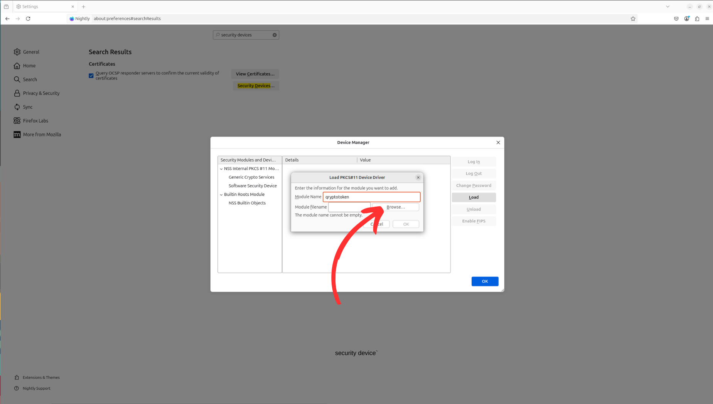
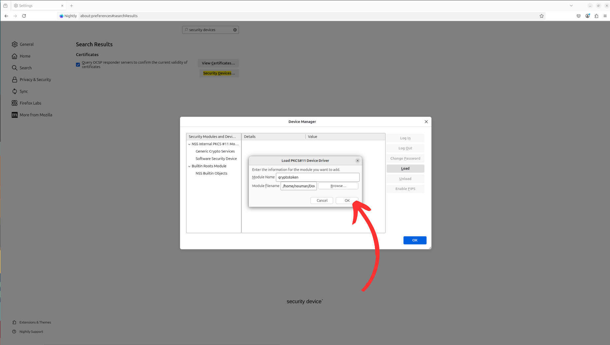
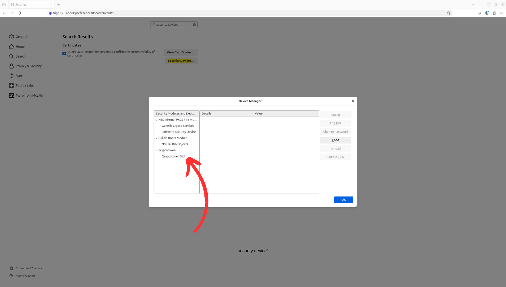

# Testing `qryoptic` with Firefox

This guide outlines how to load and interact with the `qryoptic` PKCS#11 module in a custom-built Firefox browser. It covers how to set up the Firefox profile, load the module, and run basic interoperability tests.

<details open="open">
<summary>Table of Contents</summary>

- [Testing `qryoptic` with Firefox](#testing-qryoptic-with-firefox)
  - [Prerequisites](#prerequisites)
  - [Before loading the `qryoptic` module](#before-loading-the-qryoptic-module)
  - [Loading the `qryoptic` module in Firefox](#loading-the-qryoptic-module-in-firefox)
  - [PQC connection to QUBIP servers](#pqc-connection-to-qubip-servers)
  - [Interoperability Testing with OQS](#interoperability-testing-with-oqs)
    - [**For example to test `mldsa65-X25519MLKEM768`:**](#for-example-to-test-mldsa65-x25519mlkem768)
  - [Interoperability testing with CloudFlare](#interoperability-testing-with-cloudflare)
  - [Troubleshooting](#troubleshooting)
    - [Handling `SEC_ERROR_UNKNOWN_ISSUER`](#handling-sec_error_unknown_issuer)

</details>

## Prerequisites

Before proceeding, ensure that:

- You have a build of the `qryoptic` module (`libkryoptic_pkcs11.so`), compiled following [our instructions](./build-qryoptic.md).
- You already initialized once a `qryoptic` token store, as explained in [Module Initialization](./build-qryoptic.md#module-initialization).
- You have a QUBIP build of Firefox, either you [built it from source](./build-firefox-from-source.md)
  or you [have installed a pre-built flatpak bundle](./installing-flatpak-firefox.md).
- You started a fresh instance of the QUBIP build of Firefox, **with a clean profile**, as instructed either in
  [Build Firefox from Source](./build-firefox-from-source.md)
  or in
  [Installing Firefox Flatpak Image](./installing-flatpak-firefox.md)

## Before loading the `qryoptic` module

The QUBIP build of Firefox has been modified to be aware of supported PQC
algorithms, but, by design, the cryptographic implementations are not contained
within the Firefox/NSS sources.

If you use the QUBIP build of Firefox to visit <https://fi.ib.qubip.eu:22001> or <https://test.openquantumsafe.org:6361>,
you should expect a failure stating:

```txt
Error code: SEC_ERROR_NO_MODULE
```

This is in contrast with the expected result using upstream Firefox (as of v.137.0.2, the latest released version as of this writing)
which fails with

```txt
Error code: SSL_ERROR_NO_CYPHER_OVERLAP
```

The latter signals that the client and the server cannot agree on a shared set of algorithms
(the server is configured to only support ML-DSA-65 as a signature algorithm,
while the client, i.e., Firefox, does not advertise support for this algorithm).

To proceed to a successful PQC TLS 1.3 connection using the QUBIP build of
Firefox, we need now to load the `qryoptic` module, and log into the initialized
token store.

## Loading the `qryoptic` module in Firefox

Once Firefox is running, follow these steps to load the `qryoptic` PKCS#11 module:

1. Click the **`menu button (☰)`** in the top-right corner of Firefox.

   

2. Select **`Settings`**.

   

3. In the **`search bar`** at the top-right of the settings page, type: **`security device`** and click on the **`Security Devices`** button.

   - This will open the **Device Manager** window, where you can see the default NSS modules.

   

4. Click the **`Load`** button to add a new module.

   

5. In the **Module Name** field, type: **`qryoptic`**, then click
   **`Browse...`**

   

6. Navigate to the directory where the `qryoptic` module was
   compiled, typically:

   `./target/debug/`

   Select the file with the `.so` extension (e.g., `libkryoptic_pkcs11.so`).

   

7. Click **`OK`** to confirm.

   

8. The module should now appear in the list of loaded security devices. **Select it** from the list.

   

9. Click the **Login** button on the Device Manager window.

   

10. Enter the **user PIN** you set during token initialization when prompted and click **`Sign In`**. For testing purposes, the PIN is:

    ```txt
    1234
    ```

    

If the login is successful, Firefox will now have access to the keys and mechanisms exposed by the `qryoptic` module.

## PQC connection to QUBIP servers

Once the `qryoptic` module is loaded, the token is initialized, and unlocked,
you can now establish TLS connections against public servers, with support for
the enabled PQC algorithms.

We host at <https://fi.ib.qubip.eu> and <https://it.ib.qubip.eu> two servers
(respectively in Finland and in Italy) to support the
_Internet Browsing_ Pilot Demonstrator of QUBIP.

The landing server is configured using traditional algorithms, for ease of use,
and provides links to access servers for each supported use case, and a link to
download the TLS CA of the QUBIP PKI.

Clicking on the links will connect you to co-located instances of the same
webserver, configured to enforce the use of PQC algorithms for key exchange and
authentication.

In particular, establishing a connection against _Use Case 1_ will demonstrate
a TLS 1.3 handshake, using MLKEM768-X25519 for key exchange and ML-DSA-65 for
authenticating the server identity.

## Interoperability Testing with OQS

Furthermore, you can test
real-world interoperability by performing TLS handshakes with public
post-quantum servers.

A recommended test endpoint is provided by the Open Quantum Safe (OQS) project:

> 🔗 [test.openquantumsafe.org](https://test.openquantumsafe.org)

This server supports TLS 1.3 handshakes using various post-quantum and hybrid key exchange mechanisms.

### **For example to test `mldsa65-X25519MLKEM768`:**

1. In the address bar of Firefox, navigate to:

   <https://test.openquantumsafe.org:6361>

2. If the page loads successfully and the logs indicate activity from your module, it confirms the following:

   - NSS is using `qryoptic` for key exchange and authentication of the handshake.
   - A post-quantum-enabled TLS handshake has completed, negotiated using a PQC key exchange and PQC authentication algorithm.

3. You can use the `Developer Tools > Network > Security` panel to inspect which algorithms have been used to protect this TLS connection.
4. You can examine the chain of certificates authenticating the webserver, to check which keys and signatures are PQC.

## Interoperability testing with CloudFlare

As of this writing, CloudFlare deployed support for PQ/T hybrid key exchange on most of its user-facing servers.
They also offer a landing page at <https://pq.cloudflareresearch.com/> to test your connection.

As of now, PQC authentication is not deployed, so these connections are
protected against HNDL attacks, but not against an attacker that today had
access to a CRQC and managed to break the security of any of the signature
algorithms employed in any of the certificates of the trust chain.

## Troubleshooting

### Handling `SEC_ERROR_UNKNOWN_ISSUER`


If you encounter the `SEC_ERROR_UNKNOWN_ISSUER` error when trying to visit `test.openquantumsafe.org:6361`, this is because the server's certificate is not trusted by default in Firefox.
You need to add the Open Quantum Safe (OQS) trusted CA (**oqtest_CA**) to Firefox.

1. Download the CA certificate from the following link:  
   [https://test.openquantumsafe.org/CA.crt](https://test.openquantumsafe.org/CA.crt)

2. To import the CA certificate into Firefox:
   - Open the **Preferences** menu by clicking the `menu button (☰)` in the top-right corner and selecting **Settings**.
   - Scroll down to the **Certificates** section and click **View Certificates**.
   - In the **Authorities** tab, click **Import**.
   - Select the downloaded `CA.crt` file and click **Open**.
   - Confirm the trust settings for the CA (typically, you should trust it for identifying websites).

Once this is done, retry connecting to the test server, and the `SEC_ERROR_UNKNOWN_ISSUER` error should no longer appear.
